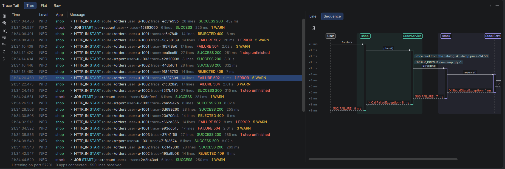
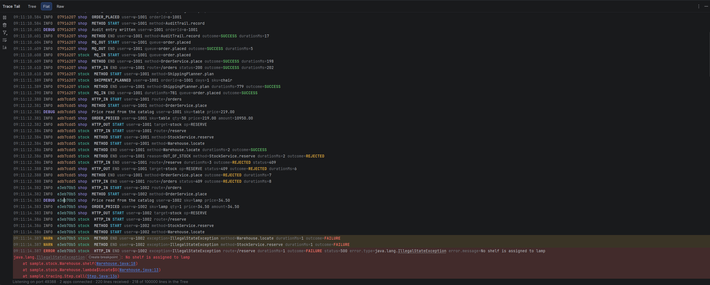
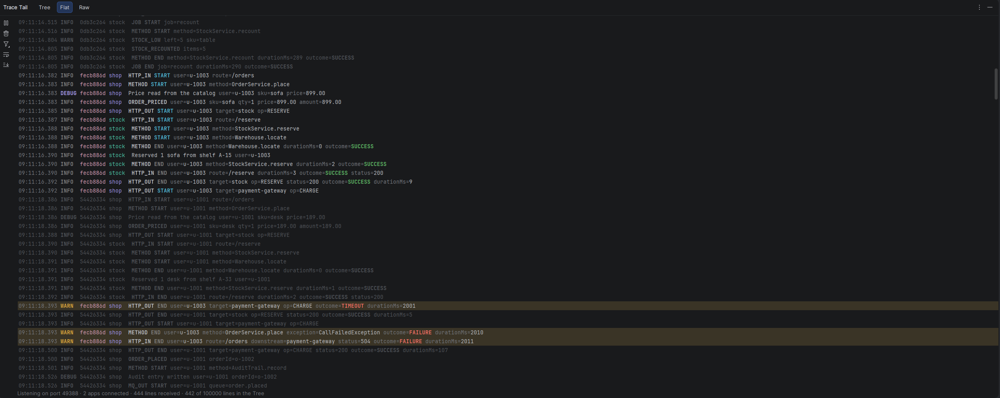
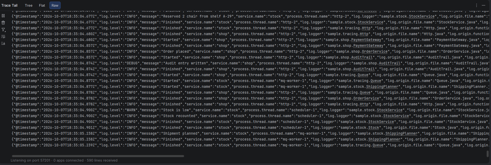

<picture>
  <source media="(prefers-color-scheme: dark)" srcset="src/main/resources/META-INF/pluginIcon_dark.svg">
  
</picture>

# Trace Tail

English | [Türkçe](README.tr.md)

[](https://plugins.jetbrains.com/plugin/34886)
[](https://plugins.jetbrains.com/plugin/34886)

An IntelliJ IDEA plugin that shows the logs of the applications you run from the IDE as a live,
trace-grouped view. The logs do not arrive as one long stream but gathered by the request they
belong to: each request is folded into a single line; opening it shows its log lines nested by
`trace.id`, `span.id` and `parent.id`. So for a request that passes through several applications,
you can see at a glance which steps it took, which step started which, and where it failed.



## Features

- **One row per request**, with its line count, outcome, duration and the number of `WARN` and
  `ERROR` lines; opening it shows its steps, nested by which step started which
- **A sequence diagram** of the selected request across apps, classes, queues and outside systems,
  which can be copied as Mermaid
- **A console of every line**, coloured per request; clicking a request's id fades the others out
- **A Trace Tail tab in each Run and Debug window**, showing only the requests that app took part in
- **Jump to Source** from a log line to the class that wrote it
- **No change to the application**: a Java agent adds itself to Logback or Log4j2 at run time

## Installation

1. In **Settings → Plugins → Marketplace**, search for **Trace Tail** and click **Install**, or
   install it from its [JetBrains Marketplace page](https://plugins.jetbrains.com/plugin/34886).
2. Run a Java application from the IDE. Its logs show under **View → Tool Windows → Trace Tail**.

To install a build of this repository instead, run the `buildPlugin` Gradle task (Gradle tool
window → **trace-tail → Tasks → intellij platform → buildPlugin**), then in **Settings → Plugins**
click the gear icon, choose **Install Plugin from Disk…** and select
`build/distributions/trace-tail-1.3.0.zip`.

See [What the application needs](#what-the-application-needs) for the logging setups the agent
supports.

## The tool window

The tool window has three tabs that look at the same logs from three angles:

| Tab | Shows |
|---|---|
| Tree | One row per request, opening into its steps. Beside it, the selected line's JSON and stack trace (Line) and the selected request as a sequence diagram (Sequence) |
| Flat | Every line in arrival order, as a console; stack trace frames link to the source |
| Raw | The JSON lines as received; useful to see exactly what the agent sent |

### Tree

Each request is one row: its first line, then how many lines it has, its outcome and duration, how
many `WARN` and `ERROR` lines it has, and how many of its steps have no `END` line yet. Opening a
row shows the request's steps, each under the step that started it. A row folds with its arrow, a
double click, or the Left and Right keys.

Shift and Ctrl select several rows; Line then shows their lines one under the other, and Sequence
draws each of their requests. **Ctrl+C** copies the request ids of the selected rows, one per line.
**Show in Flat** in the context menu opens the Flat tab on the line, with its request focused.

**F4** or **Jump to Source** in the context menu opens the class that wrote the line
(`log.logger`). The agent sends no line number: finding it walks the thread's stack on every log
call, which makes each call 8 to 30 times slower.

### Sequence

The **Sequence** diagram beside the Tree draws the selected request as a flow of who called whom.
It has a lifeline for each app, for each class whose methods log `METHOD` steps (kept next to its
app), and for the parties that write no lines: the user (who sends `HTTP_IN` and `WS_IN` and gets
`WS_OUT`), the scheduler, a queue, the LDAP system of `LDAP_OUT`, the mail system of `MAIL_OUT` and
the outside systems an `HTTP_OUT` calls. Each call, return and note is a row in the order the lines were
written; hovering over a row shows its line as a tooltip. **Copy as Mermaid** copies the diagram as
text, ready to paste into a document or a pull request description.

### Flat

The **Flat** tab colours each line like the Tree, and gives warnings and errors, with their stack
traces, a tinted background. After its time and level, each line shows the first eight characters
of its request's id, in a colour of the request's own. Clicking that id focuses the request: the
lines of the other requests fade, until the id is clicked again.





### Raw

The **Raw** tab shows each line as the JSON the agent sent, so you can check which fields a line
carries.



### Run and Debug windows

Each Run or Debug window also gets a **Trace Tail** tab once its app's first line arrives. It shows
only the requests that app took part in, with the lines the other apps wrote for them, so you keep
the rest of the request in view while you focus on one app. The app is matched by the run
configuration's name, which the agent sends as `service.name`. A run window without tabs, such as a
plain Run console, gets no tab.

### Toolbar

- pause the view; new lines are not lost but wait in the IDE until resumed
- clear the view
- hide lines below a level for one app or all (for example, only `WARN` and above). A request's main
  step, the one no other step started, keeps its `START` and `END` lines, so a request that still
  shows keeps its first row.
- **Scroll to the End**: show the newest lines. A view scrolled to its end keeps following new
  lines; scrolling up stops it, so the lines being read stay in place.
- expand or collapse all requests
- turn **Soft-Wrap** on or off: wrapped, long lines continue on the next line in the tree and the
  consoles; unwrapped, each stays on one line and the view scrolls sideways. The IDE remembers the
  choice.

## How it works

The plugin listens, for each open project, on a loopback port that only this computer can reach.
When a Java run configuration (Application, Spring Boot, …) is run or debugged, the plugin adds its
agent to the JVM:

```
-javaagent:<plugin folder>/agent/trace-tail-agent.jar=<port>,<run configuration name>
```

The agent waits until the application's Logback or Log4j2 starts, then adds an appender to its root
logger. The appender sends each log event as one
[ECS](https://www.elastic.co/guide/en/ecs-logging/java/current/setup.html) JSON line to the port.
All of this happens at run time: the application needs no added dependency and no change to its
logging configuration.

## What the application needs

The application logs through Logback 1.2 or later, or Log4j2 2.17 or later, and runs on Java 8 or
later. The agent's tests run it on Logback 1.2.13 and 1.5.20, Log4j2 2.17.2 and 2.24.3, and
Spring Boot 3.5 on either of them, all on Java 21.

The application's own logger levels decide which events are sent, as for its console; a line that a
logger's level drops does not reach Trace Tail either. A filter put only on the console appender,
however, does not affect Trace Tail. For example, lines hidden from the console by Spring Boot's
`logging.threshold.console` still show in Trace Tail. A logger with additivity turned off (one that
does not pass its events on to the root logger) sends nothing, because the appender sits on the
root logger.

The agent writes these as separate fields under their own names:

- the thread context (MDC) entries
- SLF4J 2's key-value pairs, as in `log.atInfo().addKeyValue("phase", "START")`
- a Log4j2 map message's entries; its `message` entry becomes the message

So the ids that identify a request must be in the thread context as `trace.id` and `span.id`. When
Spring Boot's tracing is used, Micrometer puts them there as `traceId` and `spanId`; the view
accepts those names too.

The agent hooks into Logback through the `logback.statusListenerClass` system property. If the
application sets that property itself, the agent has no place to hook in and its Logback lines are
not sent.

## What the view reads

| Field | Use |
|---|---|
| `@timestamp`, `log.level`, `message`, `service.name` | Every line |
| `trace.id`, `span.id` | Groups the lines by request; a line without `trace.id` shows only in the Flat and Raw tabs |
| `parent.id` | Nests a step under the step that started it |
| `event.action` | The event's name, such as `HTTP_IN`; a line without it shows its message instead |
| `phase` | Marks a step's start (`START`) or end (`END`) |
| `user.id` | The user who made the request |

A step's row shows its outcome (`outcome`, `status`) and the time between its `START` and `END`.
Every other field is shown as `key=value`.

The plugin keeps the last 10,000 lines in memory, so a changed level filter applies not only to new
lines but to those too.

The Tree keeps the last 300 requests, with at most 100,000 lines in all; the status line shows how
many it holds. A request keeps at most 5,000 lines; past that, it drops its oldest lines, a tenth
at a time. The lines inside its steps go
first, except the newest 500, so every step keeps its `START` and `END` lines. When that is not
enough, its oldest finished steps go. Its row then shows how many lines it dropped, and its `WARN`
and `ERROR` counts still include them.

An application's logging never waits on the IDE; the application does not slow down even if the
IDE does, or closes. The agent sends from its own thread and keeps at most 10,000 unsent lines; the
plugin reads each connection on its own thread and keeps at most 20,000 unread lines. Both drop the
oldest line when full. If the IDE closes while the application keeps running, the agent drops the
lines without a message.

## Requirements

- IntelliJ IDEA 2026.2 or later, with the bundled Java plugin
- To build: nothing else. Gradle downloads the IntelliJ IDEA version set in `gradle.properties`
  (`platformVersion`) and, if the machine has none, a Java 25 toolchain.

## Running from source

Open the project in IntelliJ IDEA and run the `runIde` Gradle task. A separate sandbox IDE starts
with the plugin installed; the view is under **View → Tool Windows → Trace Tail**. The sandbox IDE
opens the `sample` folder, three small applications to try the plugin with; see
[sample/README.md](sample/README.md). Once you run a Java application in this IDE, its logs start
showing in the view. The screenshots above were taken with these applications.

The agent is the `agent` subproject. The build puts its jar in the plugin's `agent` folder, outside
the plugin's class path, so the agent is loaded only into the JVM of the application being run, not
into the IDE.

The plugin's tests are the root project's `test` task. The requests in `src/test/resources/requests`
are written as the agent sends their lines. The tests read them into the view's model and check the
steps, the level filter and the Sequence tab's Mermaid text. Another test sends lines to the
plugin's port over sockets.

The agent's tests are the `agent` subproject's `test` task. Each test starts a small application in
its own JVM with the agent, on one of the logging setups in
[What the application needs](#what-the-application-needs), and checks the lines that reach its port.

## License

[MIT](LICENSE)
